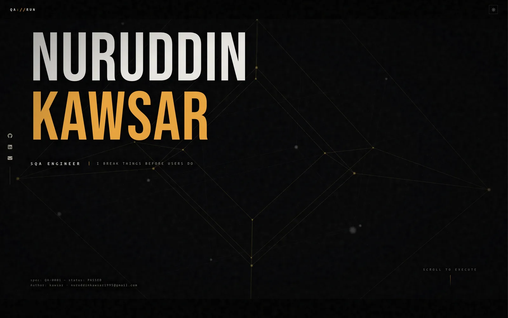
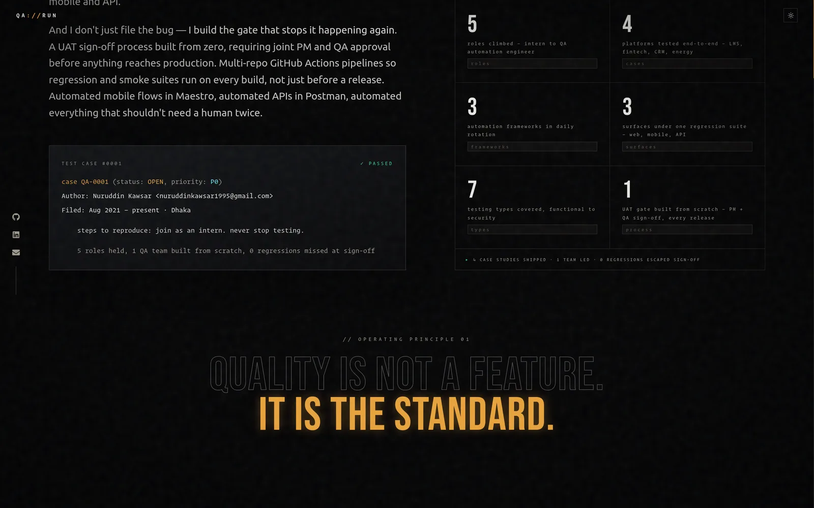
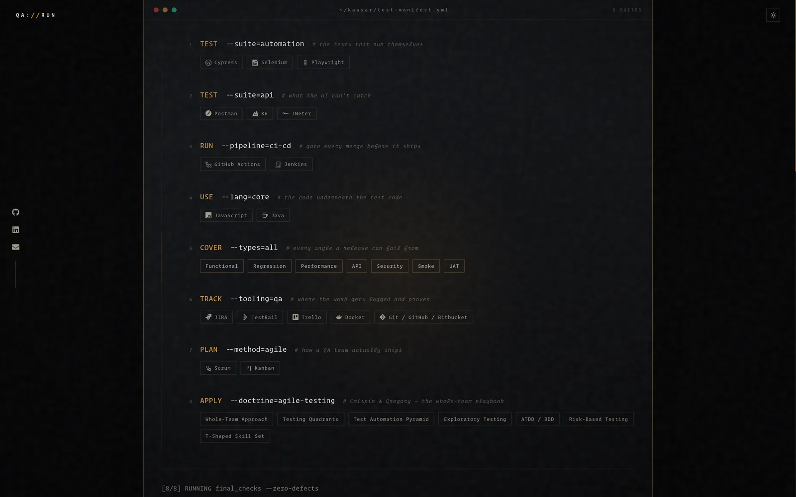
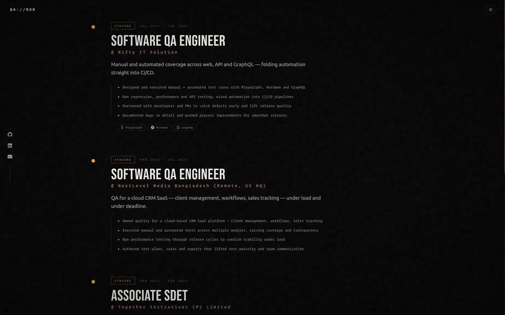
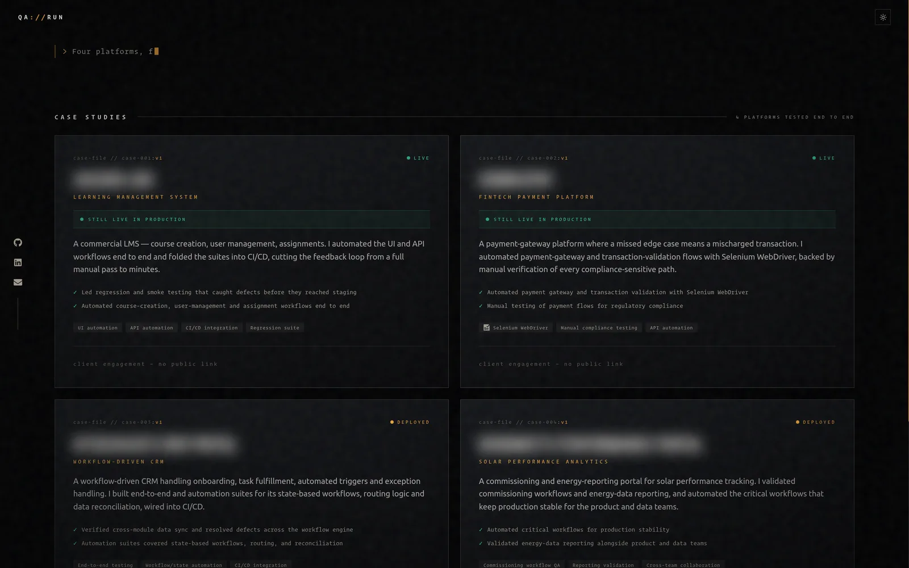
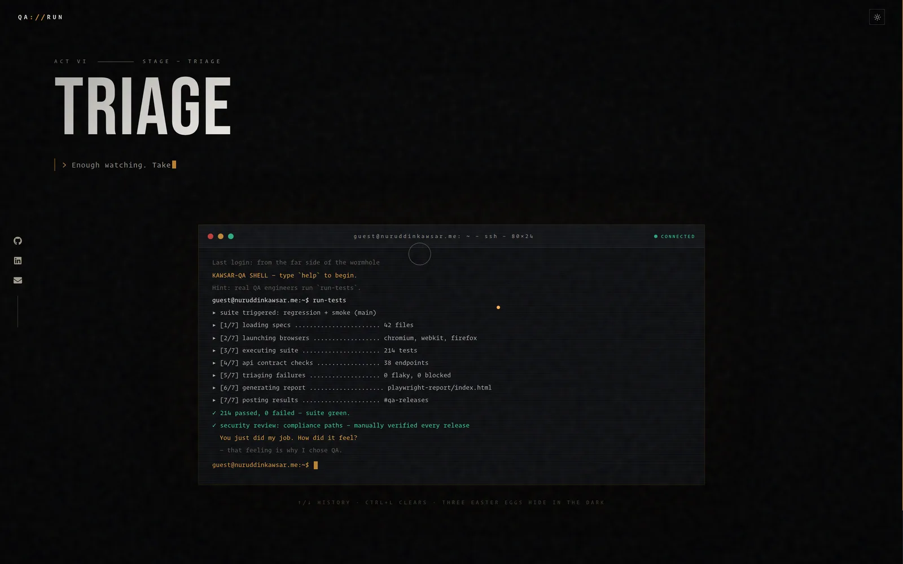
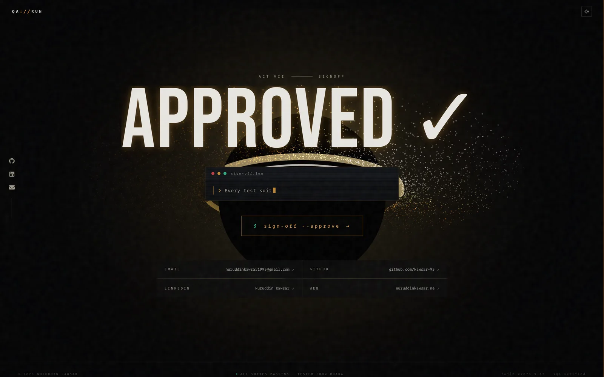

# COVERAGE — a QA run in seven acts

**Nuruddin Kawsar · SQA Engineer · Dhaka, Bangladesh**

A cinematic portfolio that doesn't _describe_ QA — it makes the visitor
_perform_ it. The whole site is a software test life cycle: scrolling runs
the engineer from `SPEC` to `SIGNOFF` through seven acts, framed like a
Christopher Nolan film — letterboxed and grain-textured, and scored by two
custom WebGL scenes: a true 4D tesseract (Interstellar) and a black hole
with a shader-driven, Keplerian accretion disk — inner particles genuinely
orbit faster, per `speed ∝ r^-1.5` (Gargantua).

Live at **[nuruddinkawsar.me](https://nuruddinkawsar.me/)**.

## Screenshots

| | |
|---|---|
| **ACT I — SPEC**<br>A rotating 4D tesseract (XW/YZ/ZW planes, projected to 3-space) behind the hero |  |
| **ACT II — PLAN**<br>Origin story, QA stats, and the "quality is the standard" principle |  |
| **ACT III — CASE**<br>Skills rendered as a YAML test manifest, tool icons included |  |
| **ACT IV — RUN**<br>Career as a run through test environments — sandbox to production |  |
| **ACT V — REPORT**<br>Four case studies; client-confidential names blurred, the work isn't |  |
| **ACT VI — TRIAGE**<br>A real shell — `run-tests` plays out an animated regression run |  |
| **ACT VII — SIGNOFF**<br>Gargantua's accretion disk behind the closing `sign-off --approve` |  |

## The acts

| Stage | Act | Experience |
|---|---|---|
| `SPEC` | I | Hero — a real 4D hypercube rotated in the XW/YZ/ZW planes, projected to 3-space |
| `PLAN` | II | Origin story + QA stats (roles, coverage, team) |
| `CASE` | III | Skills as an 8-suite test manifest |
| `RUN` | IV | Career as a run through test environments |
| `REPORT` | V | Case-study registry — four platforms tested end to end |
| `TRIAGE` | VI | A working shell — `help`, `whoami`, `run-tests`, a QA reading list, and three Nolan easter eggs |
| `SIGNOFF` | VII | Gargantua finale + `sign-off --approve` contact CTA |

## Stack

- **Next.js 16** (App Router, Turbopack, static export via `output: "export"`) + **React 19** + **TypeScript**
- **Tailwind CSS v4** design tokens, with a dark/light theme toggle (persisted, `prefers-color-scheme`-aware)
- **Three.js** via `@react-three/fiber` + `drei` — real 4D-rotation tesseract geometry, a custom GLSL accretion-disk shader for Gargantua
- **framer-motion** scroll choreography · **lenis** smooth scroll
- Bebas Neue (display) / Ubuntu (body) / Operator Mono (licensed local font, terminal & mono UI)

## Run it

```bash
npm install
npm run dev              # http://localhost:3000

npm run build             # static export -> ./out
npx serve@latest out      # preview the production export locally
```

This project builds to a static export (`output: "export"` in `next.config.ts`),
so `next start` doesn't apply — the `out/` folder is plain HTML/CSS/JS, deployed
as-is. Pushes to `main` build and publish it to GitHub Pages automatically
(`.github/workflows/`), served at the custom domain in `CNAME`.

## Details worth noticing

- GitHub/LinkedIn/email stay reachable from a persistent rail on the left, at every scroll position
- A hairline on the right edge (desktop) or bottom bar (mobile) tracks scroll progress and the current act
- The sun/moon toggle (top right) swaps the whole site between dark and light themes
- The terminal's `uptime` reports how long you've been on the page, Interstellar-poem included
- Case-study names in `REPORT` are blurred — client-confidential, the outcomes aren't
- The terminal's `run-tests` runs a full animated regression run with a pass/fail report
- The terminal's `books` surfaces the two QA texts (Crispin & Gregory) the whole site's doctrine is drawn from
- Respects `prefers-reduced-motion` (typed lines print instantly, smooth-scroll disables) and fine-pointer-only cursor effects
- Film grain, vignette and letterbox bars never sleep

---

_build v2026.9.13 · sqa-verified · zero regressions tolerated_
